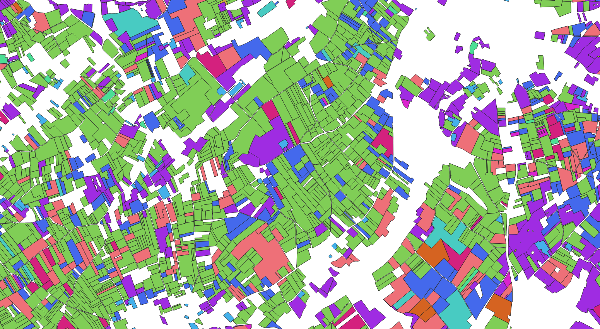

# Home

## Main objective

To have data preparation code to handle LPIS type geographic data (agricultural parcels) homogeneously on the European territory.

The objective is to move from multiple and heterogeneous data in specification to more integrated and homogeneous data among themselves.

Indeed today these data are built and disseminated (not all of them) by the various agricultural aid payment European organisms.

Each organism has a it's own data schema, whether this is:

- at the level of the parcel identification attribute

- on the attribute describing the crop of a parcel. The latter often corresponds to a code or a label in a well defined crop nomenclature.

  But this is different depending on the payment organism and is often in the language of it's country.

- on the map projection and the vector data format used.

These different data therefore cannot be easily used jointly. In particular when one wishes to use these data for web displays, statistical studies or for building learning games for AI / Deep-learning algorithms.

More concretely in terms of sub-objective / tasks, this means that we must :

- Identify LPIS data sources and provide a central point to complete and upload this data inventory.
- Document the format of the various original data.
- Allow to translate and simplify the original data (deletion of specific column attributes).
- Allow to reprojete and convert the original data according to specific spatial footprints (sentinel-2 tiling) and geojson format (GIS process).
- Allow to convert data into different code nomenclatures.
- Allow to document and centralize configurations allowing to make nomenclature change.

**However the purpose of the internship is not to do this work on the whole data but only to initiate the data organization needed and to develop a first version of code allowing to calculate these data transformations.**

To do so:

- The homogenization work will be done on three or four chosen data sources and two target nomenclatures.

These works constitute a first part and can be followed, if ever there is still time, by studies / reflections on :

- The temporal consistency of RPG data : i.e allow multi-annual queries on the data (find stable parcels and those that have evolved).

  Have origin-destination links in evolved parcels and reflect on an associated data model (SQL table modeling and associated query for example)

- Seek to automate nomenclature changes (RDF graph and ontology implementation)

We can also try to show the interest of this work with concrete examples of use such as :

- Web visualization of several homogenized data
- Calculation of statistics and comparative data visualization of crops between countries type.

## Technical choices

To meet the different needs we decided to develop and implement a github code repository which will include :

- An associated website, generated as a static site / pages via a mkdocs type engine. This documentation should be used to host documentation on LPIS data sources.
- Python notebooks associated with each data source to accompany the documentation of their specification.
- A python module regrouping the functions of data conversion.
- configuration files (nomenclature, convertion table) for each data source. Files in .txt format (.csv for example to be able to be versioned).

The code must be able to reproduce the preparation and be understandable by other European organisms so everything will be done in English.

By default we will use the existing python libraries for the processing of geographic data (pandas / geopandas, fiona).

If performance problems occurs, we can use databases (spatial extension of SQLite or PostGIS for PostGreSQL).